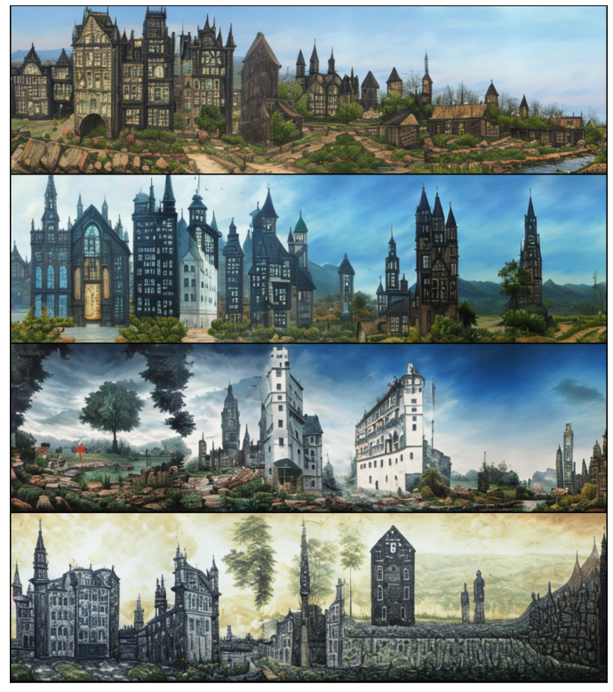

[[Paper]](https://drive.google.com/file/d/1bN1pa6h9QO_po8VKSScNxAeWzV_nl_6W/view) 
[[Colab]](https://colab.research.google.com/drive/124zC1w2qHR1ijfEPQVvLccLRBLD_3duG?usp=sharing) 
[[Kaggle]](https://www.kaggle.com/code/shonenkov/usage-rudalle-aspect-ratio) 
[[Model Card]](https://huggingface.co/shonenkov-AI/rudalle-xl-surrealist)

ruDALLE aspect ratio images
---
Generate any arbitrary aspect ratio images using the ruDALLE models

### Installing

```
pip install rudalle==1.0.0
git clone https://github.com/shonenkov-AI/rudalle-aspect-ratio
```

### Quick Start

Horizontal images:
```python3
import sys
sys.path.insert(0, './rudalle-aspect-ratio')
from rudalle_aspect_ratio import RuDalleAspectRatio, get_rudalle_model
from rudalle import get_vae, get_tokenizer
from rudalle.pipelines import show

device = 'cuda'
dalle = get_rudalle_model('Surrealist_XL', fp16=True, device=device)
vae, tokenizer = get_vae().to(device), get_tokenizer()
rudalle_ar = RuDalleAspectRatio(
    dalle=dalle, vae=vae, tokenizer=tokenizer,
    aspect_ratio=32/9, bs=4, device=device
)
_, result_pil_images = rudalle_ar.generate_images('готический квартал', 1024, 0.975, 4)
show(result_pil_images, 4)
```


Vertical images:
```python3
rudalle_ar = RuDalleAspectRatio(
    dalle=dalle, vae=vae, tokenizer=tokenizer,
    aspect_ratio=9/32, bs=4, device=device
)
_, result_pil_images = rudalle_ar.generate_images('голубой цветок', 512, 0.975, 4)
show(result_pil_images, 4)
```


### Citation:
```
@MISC{rudalle_ar_github,
    author  = {Alex Shonenkov},
    title   = {Github ruDALLE aspect ratio images by shonenkovAI},
    url     = {https://github.com/shonenkov-AI/rudalle-aspect-ratio},
    year    = 2022,
    note    = {Accessed: 13-04-2022}
}
```
